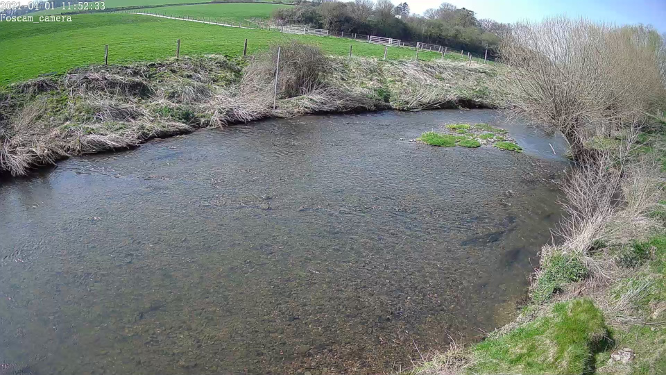
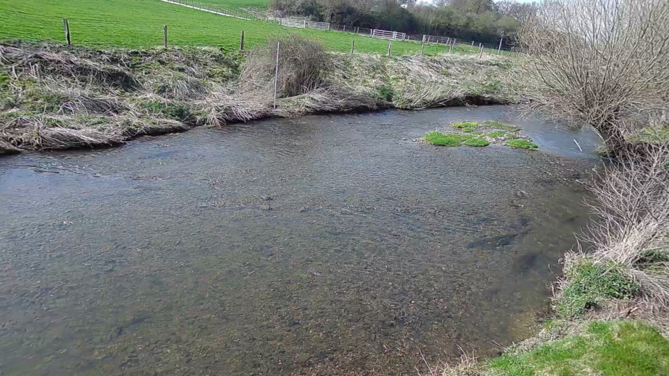
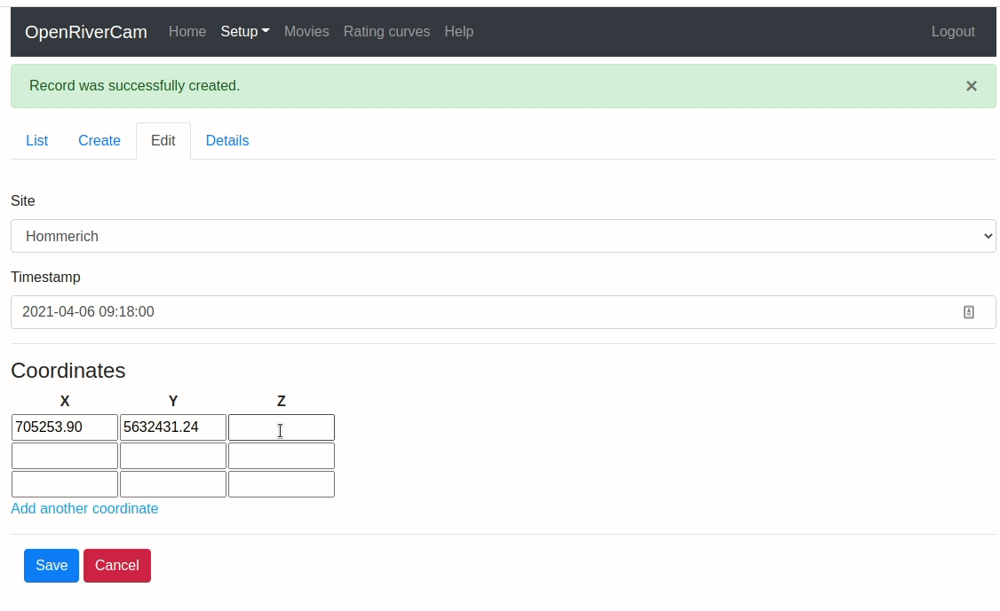
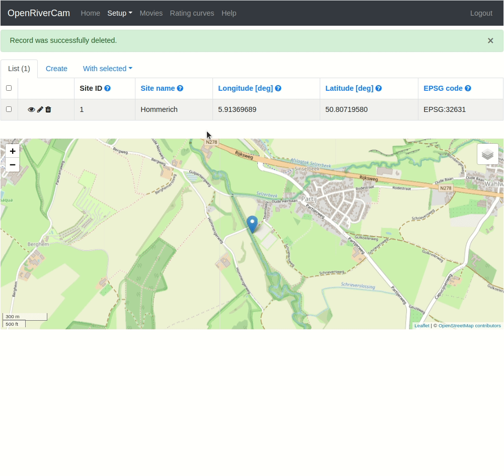
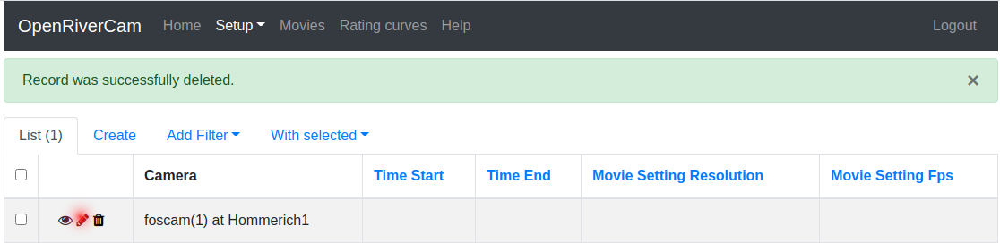

.. _cameras:

Camera configurations
=====================
In OpenRiverCam, for each site that you wish to monitor, a camera needs to be installed. This camera is of a specific
type, and will be installed at a certain position, looking at the stream at a certain angle. Furthermore, the camera
will record videos with a certain resolution and frame rate. This may differ per site. In order to have OpenRiverCam
be able to extract frames from a video, understand how to orthoproject them on a geographical surface, and understand
at what spatial scale it should look for traceable patterns on the water surface, a camera configuration is needed.
Configuring a camera for a given site entails the following parts:

- adding the camera type and its lens characteristics to your database, the same camera type may be used for
  different sites.
- Choosing a camera type for the site you are configuring.
- Provide a bathymetry for the site.
- Prepare the orthoprojection settings. This entails: a) Assigning an exact number of 4 ground control points, that
  match 4 pixel locations on the water surface, as well as the water vertical level and lens position; b) choosing an
  area of interest that you wish to reproject; c) choosing a pixel size (typically in the order of one or more
  centimeters) that orthoprojected images should have.
- Prepare the Particle Image Velocimetry settings. At the moment this only entails choosing a `window size`. This is
  the amount of pixels in the orthoprojected frame that are used to find patterns and estimate a velocity for.

In the subsections below, we demonstrate what you should do to

Camera type
-----------
To add a new camera type, navigate to the `Setup` menu, choose `Camera types`. If you have already created camera types
before, you will see these camera types listed. If not, an empty list with only headers is provided. To establish a new
camera type (for instance if you have acquired a new camera), click on `Create`. You will then be requested to type in a
name for the camera. Here you can fill out the model name or any name that you can refer to yourself with ease. Also
you are requested to fill out a number of lens parameters. Theser are needed to correct the image for distortion
before doing any orthoprojection. The parameters are listed below with a short explanation and some default values you
may select if you are in doubt.

- `k1`:   barrel lens distortion parameter, this parameter describes the curvature of the lens. The fact that a lens
  is curved makes the centre of a photo or video magnified slightly more than the edges. That makes straight lines
  appear to curve around the edge of the image. If you do not know what to feed in here, please select 0. The exact
  value is typically a very small negative number for lenses that are thicker in the middle, and positive for lenses
  that are thinner in the middle than at the edge. A typical value could be -0.000005 for instance.
- `c`:    optical center. This parameter determines which point on the lens is the point where light passes through on
  a straight line. The most common value is 2 (meaning light passes straight at the center of the lens). In doubt,
  please use 2.
- `f`: focal length of the lens, measured in millimetres (mm). Usually this parameter can be found on the lens manual.
  Typical values for security cameras are in the order of 4 mm, which is commensurate with a very high view angle. If
  in doubt, select a value in the order of 10 mm.

If you are clueless about the lens parameters, then simply fill out the following values:

- `k1`: 0
- `c`: 2
- `f`: 1

Essentially this leads to no correction, which is usually better than a very poor correction. We plan to include a
guidance for lens parameter corrections in which you can visually modify the parameters until you get a satisfactory
result in a software update.

In the image below, you can see the effect of lens corrections for an image taken at our experimental site at Hoeve
Hommerich, Limburg, The Netherlands using a Foscam FI9900EP model. In this case, the camera manual provided the focal
length of the lens (4mm), the optical center was assumed to be 2, and the barrel distortion parameter was determined
by trial and error, and found to be about -0.000003.

.. table::
   :align: center

   +---------+---------+
   | |logo1| | |logo2| |
   +---------+---------+

Left: Raw image from FOSCAM FI9900EP model. Right: Undistorted image with `k1`: -0.000003, `c`: 2, and `f`: 4 mm
from FOSCAM FI9900EP model.

Similar to the `Site` configuration, you can edit the camera type parameters after having stored the camera type, by
selecting the Edit icon left of the given camera type in the list view.

.. warning:: Changing camera types  has to be done with great care. Note that if camera configurations have been created
   that are dependent on the camera type you are editing, the locations of pixels identified as ground control points
   in the frames may shift, and therefore rendering new results from that camera configuration invalid. We recommend
   not to alter camera types once you have configured cameras dependent on this camera type.

Cameras on sites
----------------
When at least one camera type with lens parameters is defined, you can add a camera to a given site. Naturally, this
means you should also have defined at least one site to do this. To configure a site, please refer to :ref:`Site
management <sites>`.

To add a new camera to a site, navigate to the `Setup` menu, choose `Cameras on sites`. If you have already
created cameras on sites before, you will see these cameras listed. If not, an empty list with only headers is
provided. To establish a new camera on a given site, click on `Create`. You will then be provided with a form in
which you simply need to select the site at which the camera is installed, the camera type you have installed (and
configured before in the `Camera type` menu) and whether the camera is currently active on that site or not.

Again, similar to the `Site` configuration, you can also change the camera on sites by clicking on the Edit button in
the icons left of a given camera on site. This may for instance be needed if you wish to make a camera on site
inactive, because you have installed a new camera, of a new type on that given site.

.. note:: in principle it is possible to have two cameras active on one site. This may for instance be useful if you
   wish to have flow estimates from different angles, e.g. in case you want to rely on one camera's results for morning
   shots, and another for afternoon shots. This can be useful in case lighting conditions in different parts of days
   negatively affect the results from either one of the cameras.

.. _bathymetry:

Bathymetry
----------
Similar to selecting a camera for a site, you also need to provide a bathymetry for that site. You may be familiar
with so-called `Y-Z tables`, that essentially describe a profile from left to right bank with a coordinate `Y`
measured from a starting location on the left bank with Y-coordinate zero, and ending at some location on the right
bank with a Y-coordinate having an offset in meters from the left bank. The Z-coordinate is then the vertical
coordinate of the bottom of the stream. This works well if the cross section under consideration is used to integrate
information on velocities that is not geographically referenced.

In OpenRiverCam, we use 2-dimensional velocity information, and require this to have a geographical reference.
Therefore, we also need to provide, rather than Y-coordinates, X and Y coordinates that are in a geographical space.
The X-Y coordinates must be provided in the geographical coordinate reference system (crs) that applies to the site.
The preferred option is to use the crs that has been provided with your site while setting it up. If you need to look
it up, please first go to the list view of your sites, and look up the EPSG code for your site. You can then convert
the bathymetry coordinates, recorded on-site into this coordinate reference system.

To establish a new bathymetry, navigate to `Setup`, and then `Bathymetry`. Similar to setting up a new site, click on
`Create` and then select the site for which you wish to establish a bathymetry, and the time at which the bathymetry
was recorded. The time is important, as this may give a better understanding of changing conditions of the
bathymetry on that site. Once you have created a new bathymetry, you can start adding bathymetry points to it, as
shown in the animation below. Add as many points as you want. Only make sure that they are ordered from left to right
entirely. Once you are done, click `Save` to store the results in the database. You can always edit the points by
selecting the `Edit` button left of the bathymetry.

An alternative way to providing bathymetry is to paste a list of coordinates in comma-separated-values (CSV) format.
This format should have as header the EPSG code in which the eastern (x) and northern (y) oriented coordinates are
given. The content is a simple set of rows, with `X, Y, Z` where X is the Eastern oriented coordinate (or longitude),
Y is the Northern oriented coordinate (or latitude) and Z is the elevation, in the reference system you used, or your
GPS device used. If you use CSV inputs, you are free to use the CRS, represented as EPSG code, of your choice
to feed in coordinates. They will be automatically converted into the CRS of the site with which the coordinates are
used. This is ideal if you use an RTK GPS device, as these mostly give coordinates in latitude and longitude. Note that
if you provide latitude and longitude coordinates, also the order should be the Eastern oriented coordinates first,
and then the Northern oriented coordinates. An example of a set of latitude longitude points with
bathymetry is given below. This is a bathymetry used for our site in The Netherlands, Limburg. It will be automatically
converted to the local EPSG code 32631 (UTM zone 31 North) when fed into the bathymetry editor.

.. code-block::

    EPSG:4326
    5.91330733, 50.80720217, 141.100
    5.91331467, 50.80720417, 141.000
    5.91332283, 50.80720633, 140.800
    5.91333167, 50.80720800, 140.600
    5.91333717, 50.80720900, 140.500
    5.91334283, 50.80721133, 140.100
    5.91334933, 50.80721217, 139.700
    5.91335933, 50.80721433, 139.400
    5.91336650, 50.80721633, 139.300
    5.91337250, 50.80721750, 139.200
    5.91337900, 50.80721950, 138.800
    5.91338550, 50.80722150, 138.800
    5.91339217, 50.80722317, 138.700
    5.91339833, 50.80722500, 138.700
    5.91340317, 50.80722600, 138.400
    5.91340917, 50.80722750, 138.400
    5.91341600, 50.80722900, 138.300
    5.91342367, 50.80723083, 138.300
    5.91343117, 50.80723250, 138.300
    5.91344117, 50.80723367, 138.300
    5.91345283, 50.80723517, 138.400
    5.91346467, 50.80723733, 138.400
    5.91347567, 50.80723917, 138.400
    5.91347550, 50.80723900, 138.300
    5.91348533, 50.80724033, 138.400
    5.91350017, 50.80724317, 138.300
    5.91351133, 50.80724550, 138.300
    5.91352417, 50.80724733, 138.300
    5.91353433, 50.80724867, 138.300
    5.91354583, 50.80724950, 138.300
    5.91355567, 50.80725017, 138.300
    5.91356517, 50.80725150, 138.400
    5.91357917, 50.80725733, 138.400
    5.91358317, 50.80725817, 138.800
    5.91358783, 50.80725900, 139.100
    5.91359150, 50.80725917, 139.400
    5.91359600, 50.80726017, 139.600
    5.91359933, 50.80726067, 139.800
    5.91360650, 50.80726100, 139.900
    5.91361367, 50.80726183, 140.000
    5.91361867, 50.80726267, 140.200
    5.91362383, 50.80726350, 140.400
    5.91362933, 50.80726367, 140.600
    5.91363650, 50.80726417, 140.700
    5.91364400, 50.80726450, 140.800
    5.91365100, 50.80726500, 141.000
    5.91365650, 50.80726567, 141.100
    5.91366483, 50.80726717, 141.100

.. caution:: make sure that you start with the left-bank coordinate. If you do not so this, you will still get a
   discharge estimate but it will be the discharge estimated as if flow is from downstream to upstream. Therefore you
   will get a negative number instead of positive.

Once you are satisfied, click `Store CSV` to save the comma-separated text values. In the animation below, you can
see how the process works.

Camera configuration
--------------------

Once a camera is chosen for a given site, the camera needs to be further configured, so that OpenRiverCam can perform
orthoprojection, and understands at what spatial scale the velocimetry needs to be performed. The prerequisites are
that a site is added, a camera type is added, and a camera on site is added, that links a camera type to a given site.
To start a camera configuration, first navigate to `Setup` and then `Camera configuration`. If you have added
camera configurations before, you will see a summary of those listed. You can edit a camera configuration from this
screen as well, in the same manner as editing a site in the `Site` configuration view.

To add a new Camera configuration, click on `Create`. You will now go through several screens, described in the
following subsections.

Choose a camera on site
~~~~~~~~~~~~~~~~~~~~~~~

First you need to pick a camera belonging to a site. You should have configured this before, choose this from the
list of cameras on sites available. You should now see a similar screen as below. Many components of the
configuration are still missing. To complete the configuration, click on the Edit button as indicated in the figure
below.

Selection of validity period and a sample movie
~~~~~~~~~~~~~~~~~~~~~~~~~~~~~~~~~~~~~~~~~~~~~~~

You will be led to a new screen where you can identify for what period the Configuration is valid. In case you
physically change the camera later, for instance by replacing it for a different model, by altering the view angle
or frames per second settings, resolution or other settings, you can later change the end date/time to the last moment
on which the camera configuration was valid, and make a new configuration with the start date/time at the moment of
the end date/time of the old camera configuration.

Furthermore, for the next edit steps, you will need a sample movie, which will be used to perform the configuration
steps related to the ground control points, orthorectification, and velocimetry parameters. Provide a movie with only
a few seconds (5 is enough) to continue the configuration. This movie needs to contain the situation in the
objective of the installed camera, with all ground control points in view and with the staff gauge in view. To
better understand what needs to be surveyed in order to finalize the configuration, please refer to the :ref:`field
manual <survey>`.

Once the video is select, click on `Save` to process the movie into individual frames corrected for lens distortions.

.. note:: The idea of the next configuration step is that you can recognize and select the ground control points.
   Therefore it is important that you check, before leaving your site after survey that a movie with all ground control
   points is indeed available and the ground control points can be easily recognized. After that has been checked, you
   can remove the ground control points from the site, if they are intrusive to the environment (e.g. plastic markers).
   If you decide to change the camera view, by e.g. moving or rotating the camera, you need to change the ground control
   point locations as well.

.. _gcp:

Ground Control Points, camera location and staff gauge reference level
----------------------------------------------------------------------
In the next configuration step, you are required to provide the following information:

- First, provide your ground control points. You can do this by left-clicking on the shown image frame from your
  sample movie, on the 4 ground control points in the objective. After that, fill in the exact coordinates of the
  ground control points in the fields X and Y (for east-west oriented and south-north oriented coordinates). If
  possible supply these coordinates in the same projection system as used for the site. If you do that, the resulting
  projected files can be visualized in a GIS program, on top of background maps. If you only have a local coordinate
  system, e.g. when you have used a dumpy spirit level for surveying, then you can still enter these coordinates, but
  bear in mind that you can then not plot the resulting projected frames on a GIS environment.

  .. image:: img/gcps_edit.gif

- Second, you will have to provide 4 corner points that identify your area of interest. Starting with the most
  upstream left, then the downstream left, then the downstream right, and finally the upstream right coordinate. The
  order is very important, as this order ensures that in your projected end result, water always flows from left to
  right. The animation below shows how you should select these points. In this example, the upstream part of the stream
  is located on the left-side of the image, hence the first click is on the bank shown on the left side, on top. If you
  would have a camera pointing upstream on a bridge, your first point should be on the right-top side of the objective,
  the second on the bottom right, the third on the bottom left and the last on the top-left.

- Third, you will have to provide information that allows OpenRiverCam to re-interpret the locations of groujnd
  control points in new movies, with different water levels. Because of the change in water level, the water moves
  closer (when water level is higher than in your sample movie) or further away from the lens (when  the water level is
  lower. This can easily be re-interpreted by providing:

  - the measured height in your reference system (e.g. a GPS uses a typical WGS84 reference level). Simply provide the
    water level value read with your RTK survey, or the water level measured with dumpy level readings
    if you have used a dumpy spirit level.
  - the water level as read from the staff gauge in place on the site. This is because for any new movie, you will
    read the staff gauge to interpret the water level.
  - the coordinates (X, Y and height) of the position of the lens, as measured in the coordinate reference system you
    have used throughout your entire survey, whether RTK or dumpy spirit level.

.. note:: it is very important that all coordinates you use throughout the camera and bathymetry configurations are
   *in the same coordinate reference system* (CRS), and that this is a coordinate system in meters (not latitude
   longitude). Ideally use, the same CRS as used for the site. Latitude longitude locations can easily be converted into
   the CRS of your site, by using the Free and Open Source Software package QGIS. To obtain QGIS please go to
   `http://www.qgis.org/ <http://www.qgis.org/>`_. A further explanation of the required GIS manipulations is out of
   scope of this manual.

