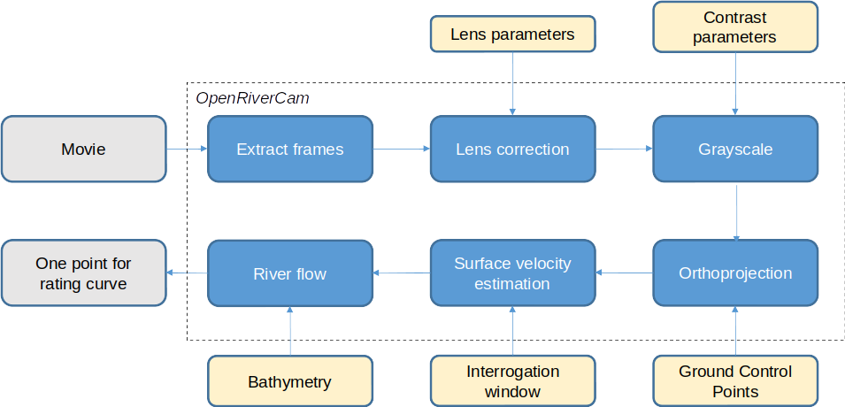

.. _movies:

Movie management
================

After setting up a site including a staff gauge, configuring the camera, and providing cross sections, individual short
movies can be processed into surface flow velocities, and river discharge. Movies of 5 seconds at 1080p resolution
and 25 or 30 frames per second at 5Mbps bit rate are enough to yield good results. The process that OpenRiverCam
follows for this is displayed in the schematic below. The process can be run fully automated. At this stage we do not
yet offer interoperability in the processing of movie shots. We do offer the ability to inspect results of the
processing.

The steps are as follows:

- Individual frames are extracted from the movie
- Each frame is corrected with the camera type's specific lens parameters, so that no distortions due to the lense
  shape appear in the frames
- Each frame is turned into a gray scaled. This is because Particle Image Velocimetry works with single-channel images
- Each frame is orthoprojected on a geographical plane using collected :ref:`Ground Control Points <gcp>` and the
  water level read out from the present staff gauge
- All frames are organised in frame-to-frame pairs, and velocities estimated from them. In the process, noisy and
  spurious velocity estimates are removed
- All valid frame-to-frame pair velocities are reduced to median, 5, 25, 75 and 95
  percentile velocity estimates. These are finally integrated to median, 5, 25, 75, 95 percentile river flow estimates
  using collected bathymetry data

The end result is a read out water level, combined with an estimated river flow over the cross section. In addition,
velocity estimates per frame pair, and for the 5 quantiles mentioned are available in OpenRiverCam's database.

Uploading a new video
---------------------
A movie is always tied to a given camera configuration. Therefore, in order to be able to upload and process movies,
first, a camera configuration needs to be in place, that is commensurate with the camera setup (site, precise
location and angle of view, camera type) used to record the movie that you are about to upload.

.. note:: If you have changed the camera setup on a specific site, the control points and location and orientation
   of the camera no longer match with the old camera configuration. Therefore if you do this, then also re-survey
   ground control points and the camera lens position, and establish new camera configuration with it.

Uploading a video is very simple. Go to the `Movies` menu item, click on `Create`, and then fill out the details.
These include the camera configuration that the movie belongs to, the time stamp of the movie and finally, the video
itself, which you can select by simply browsing to the file on your local drive containing the movie. Click on `Save`
and the movie will be uploaded. You will be brought to the list view, which contains all uploaded movies, by the user
currently logged in.

Movie status
------------
A movie, once uploaded can have different statuses. These are briefly described below:

- MOVIE_STATUS_NEW: a newly uploaded video, no data extracted yet
- MOVIE_STATUS_EXTRACTED: a lens corrected snapshot is extracted from the video. This status will automatically
  follow after MOVIE_STATUS_NEW, usually after a few seconds. Once this status is in place, you are ready to `Edit`
  the movie and add a water level, read from the staff gauge within view to it.
- MOVIE_STATUS_PROCESSING: the movie is being processed. We provide a more elaborate description what happens
  during processing below.
- MOVIE_STATUS_FINISHED: the movie is entirely processed and results can be investigate by navigating to the `View`
  button, left of the respective movie.
- MOVIE_STATUS_ERROR: something went wrong during processing, or connection with the back end was unstable or lost
  during processing. If this happens, please delete the movie, and upload it freshly, and process this again. If all
  your movies consequently fail to process, then most likely, the camera configuration contains errors, or the
  bathymetry is not within the area of interest selected. Please carefully check if the bathymetry is in the right
  position geographically.

Movie processing
----------------
Once movies are in the MOVIE_STATUS_PROCESSING state, many different steps are taken in the backend. The overview
below is meant to provide an understanding of this process in more detail.

1. Raw frames are extracted and orthoprojected into the site's crs. Internally they are stored as GeoTIFF files
2. Frame-to-frame velocities are estimated over the chosen window size (see :ref:`cameras`)
3. Velocities are filtered for spurious velocities based on time-based filters and spatial-based filters (e.g. locations
   with velocities that go both up and downstream are filtered out, velocities that do not have neighbouring windows
   with valid velocities are filtered out);
4. Velocities over the bathymetry points are selected through nearest neighbour interpolation
5. Places in the cross section where no valid velocity has been observed are filled in using the assumption that
   velocities have a logarithmic relationship with depth. This typically occurs in areas that are obscured by
   vegetation, are shaded, are affected by reflections of the sun. The relationship looks as follow:

.. math::
   v_z = k \left( \ln \left[ \frac{z}{z_0} \right ] \right)

where :math:`z` [m] is the depth, :math:`z_0` [m] is the roughness depth and :math:`v_z` [m s :math:`^{-1}`] is the
velocity at given depth :math:`z`. Here we decided to choose :math:`z_0` very conservatively on 0.05 meters.
:math:`k` is a coefficient with unit m s :math:`^{-1}` and is fitted using the known depth and surface velocity
estimates over the bathymetry points with valid velocimetry derived velocities.

6. River discharge is estimated by integrating the velocities over the depth and the width, assuming a simple scaling
   relation from surface velocity to depth-average velocity. We calculate flow as follows:

.. math::
   Q = \alpha z \int_w v_z \left(w \right) dw

where :math:`Q` [m :math:`^3` s :math:`^{-1}`] is the river flow, integrated over the entire cross section width
:math:`w` [m], and :math:`\alpha` [-] is a coefficient translating surface flow velocity into depth averaged velocity.

.. note:: currently, we do not support changing the settings of the filtering procedures. We also do not yet have
   functionalities to analyze or download intermediate results such as unfiltered velocities, velocities per time step,
   and the surface velocities interpolated onto the bathymetry. We may offer such functionalities at a later stage.
   In the back-end we use GeoTIFF as a format to produce orthprojected frames and NetCDF for all velocimetry results and
   integrations to cross-sectional specific discharge and river flow. When download functionality is provided, these
   formats will allow for scientific inspections of results. Please contact us if you would like to see these
   developed for your use case.

From movies to rating curves
----------------------------
At least 5 movies for one specific site need to be processed in order to make a rating curve. Please refer to
:ref:`rating` to establish rating curves.
