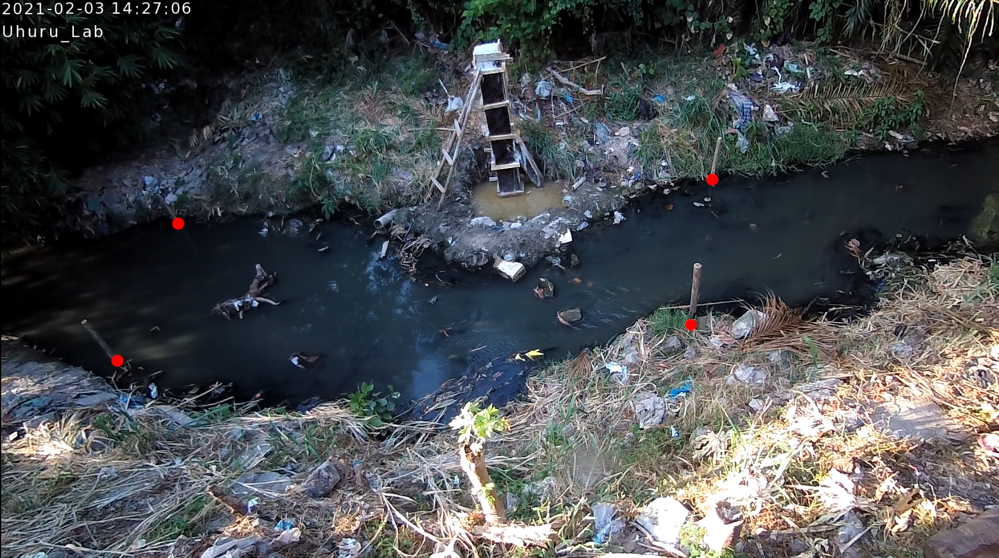
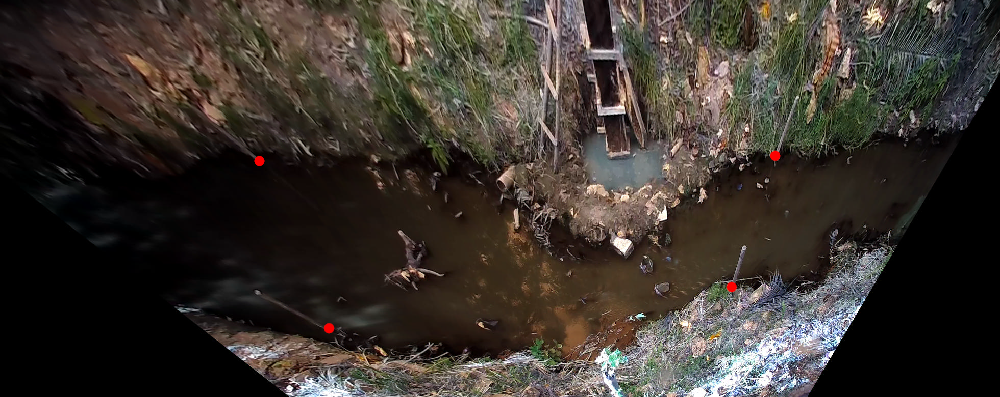
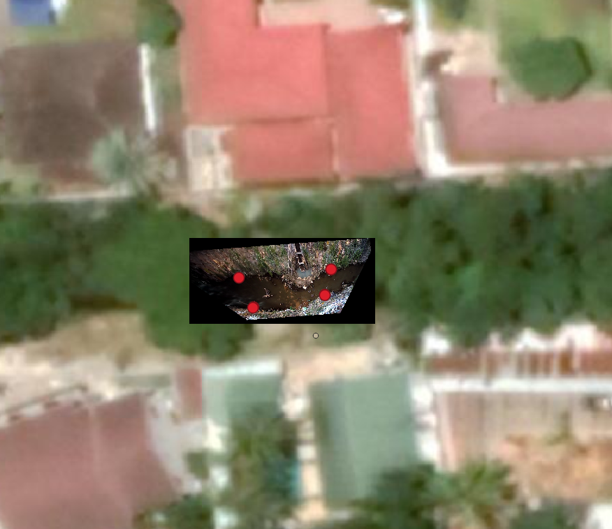
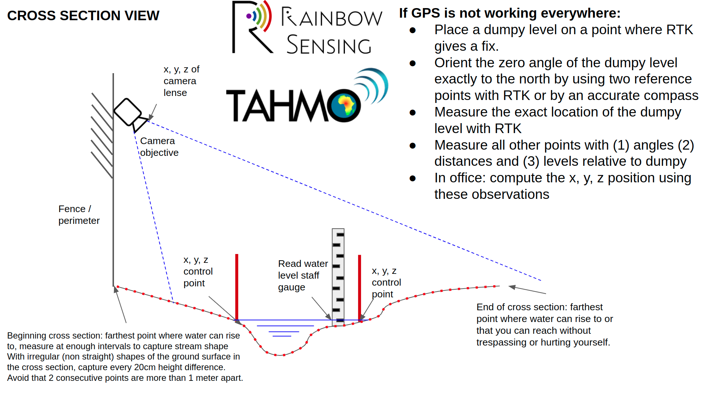
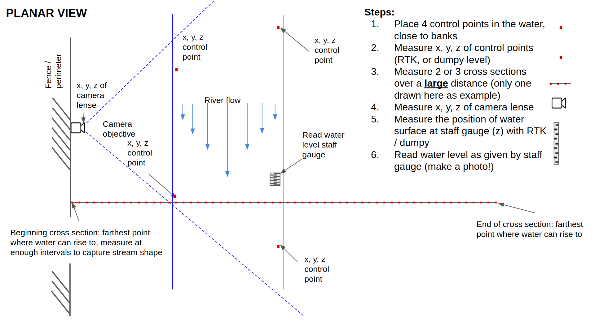

.. _survey:

Field manual
============

In this section, we will show how you can establish a new site, including the installation of hardware, and surveying
of Ground Control Points and cross sections. The field work provides the direct input in OpenRiverCam for setting
up a :ref:`new site <sites>` and to set up a :ref:`camera configuration <cameras>` for that site.

.. _site_choice:

Site choice and setup
---------------------

Choosing a site
~~~~~~~~~~~~~~~
The site we are using as an example here is `Uhuru Labs <http://website.uhurulabs.org/>`_, Dar es Salaam Tanzania.
Uhuru labs (a Rainbow Sensing partner) is situated along the Chuo Kikuu stream. It is an ideal place because of the
following reasons:

- a good view of the river is available over a quite wide cross sectional area. This enables us to see a lot of
  water, also during high water conditions
- A view angle of about 45 degrees deviating from exactly down facing is used. We recommend to ensure that the
  angle is not larger than this. The more vertical the orientation, the better
- there is a good and solid mounting place available, in this case a perimeter wall
- permanent energy supply including PSU was available
- permanent internet
- the perimeter wall is 3 meters high, making it difficult to vandalise or steal the camera

In selecting a site, these points need to be considered. In many cases, less ideal conditions will be faced and other
site setups as described above may be preferred. Typical logical sites are wall perimeters, bridges (albeit security
is an issue in many cases) or buildings, neighbouring a stream.

Materials needed for video taking
~~~~~~~~~~~~~~~~~~~~~~~~~~~~~~~~~
Below we list the typical equipment needed to be able to establish and maintain a site.

`Permanent site equipment:`
Our Uhuru Labs site is an example of a permanent site. What is needed is:

- a camera that can autonomously or manually remotely acquire videos at at least 1080p (1920x1080) resolution, at
  least 25 frames-per-second, and a bitrate of 5Mbps. There are several options to establish a site with fixed
  location and orientation:
- a mount for the camera, so that its location and direction can be fixed
- permanent power supply
- if operated remotely, a secure connection to the camera. CCTV camera suppliers may offer an online graphical user
  interface for this
- a staff gauge, well established, and covering the entire potential range of water levels.

If you are not capable to get these materials installed, this does not mean that OpenRiverCam is not for you. It
simply means the manner of use may be different. Below we present two possible alternative approaches to getting good
quality and well-orthoprojected videos.

`Raspberry pi camera with a script and SD card`
Imagine you want to collect videos over a relatively short period (e.g. short rainy season) and capture one or two
high flow event so that you can establish a rating curve from it. For such a case, a less-permanent camera fits the
purpose very well. If you are capable of programming a raspberry pi camera, we highly recommend a Raspberry Pi 4 unit
(1GB memory model) and a HQ Picam. Materials you will need are:

- a Raspberry Pi 3B+ or 4 unit (1GB memory)
- a Raspberrry PI HQ camera. Only the HQ works at 1080p
- an SD card with enough space to carry the movies you will record (with 1080p, 5Mbps and 25fps you will need about
  2-3 MB per movie shot, with 15 minute intervals and only during the day, this would amount up to about 4 GB of movie
  material over a month.
- a battery with sufficient capacity, for instance a 12V battery
- a DC converter unit from 12V to 5V (2A).
- regular micro-USB to USB-A cable for powering
- an outdoor camera enclosure, either home-developed or preprinted

A typical setup may consume about 5W of energy on average. With a typical car battery, the setup can last for more
than a week. You can simply collect data and replace the battery once a week and upload your videos.

`Smartphone data collection`

Another interesting alternative is a smartphone. The great thing about a smartphone is that you can simply go to a
site, take a recording from out of your pocket and come back the next time interval (day, hour, and so on). There are
two issues to consider:

- OpenRiverCam assumes that movies are taken from a fixed position and fixed angle side and downwards always, and
  that the lens type and movie settings are always the same
- OpenRiverCam uses a camera configuration to ensure videos are treated the same way for a certain type of camera,
  positioned at a certain spot.
- We have not yet implemented stabilization into our software, to stabilize movies that are moving.

To take care of these two issues, we recommend establishing a bracket for the smartphone on a fixed pole, that is
fixed such that if the smartphone is held in it, the lens is always pointing at exactly the same objective. Also,
always the same smartphone and the same movie settings (1080p! 25 or 30fps) should be used. Movies can simply be
emailed or downloaded at home with a solid internet connection.

.. _site_survey:

Survey
------
Use of survey information
~~~~~~~~~~~~~~~~~~~~~~~~~
We first explain how the information, provided through the site survey, is used in the processing.
In this way, you have an understanding what information is needed and why, making it easier to replicate the steps.

In order to translate a simple movie of a few seconds into stream velocities and river discharge, it is necessary to
translate the locations of individual pixels in movie frames, into geographical coordinates. In other words, a
certain  row and column in a photo, needs to be transformed into a northing and easting coordinate. And once
velocities are known, we need to know how deep the water is over minimal one cross section in order to estimate
river flow. The process of making a photograph geographically georeferenced (i.e. as if you are looking at the scene
from above and pixel distances are measured in meters) is called `orthoprojection`. It is demonstrated in the
figure below with a single frame from a 1080p movie from the Chuo Kikuu stream, at Uhuru Labs. In this case a camera
was mounted on an approximately 3 meter high perimeter wall, with electricity and internet available within the
perimeter. The left-hand side shows the original photo, with clearly marked ground control points, represented by 4
sticks placed in the water with good spread in both upstream-downstream direction and left to right bank direction.
The right-hand side shows the same but now projected onto a horizontal plane.

|pic1|  |pic2|

The figure below shows that the orthoprojection can be plotted in the open GIS software QGIS. This is because it is
geographically aware and has a properly defined x and y axis in a local projection system. Here the UTM zone 37 South
is used, (EPSG code 32737). We recommend using a local UTM zone in most cases. Tanzania in this case, usually uses
UTM 37 South. The data is stored as a GeoTIFF file.

Exactly this process is performed on all river shots, and you can see clearly that the projection can handle images
taken from an `oblique` angle (i.e. not directly from aboven, but under an angle from the side). The projection is also
automatically modified to the water level during the movie shot. This is necessary because the water gets closer
(further away) from the camera objective as water rises (falls) and as such pixel to pixel distance become smaller
(larger). Once all fieldwork is done, the software entirely takes care of these complicated orthoprojections for you.

Survey equipment
~~~~~~~~~~~~~~~~
About 10 cm accurate survey points are needed, therefore the following equipment is needed.

- A dumpy spirit level with staff gauge, OR:
- RTK GPS equipment, with a base station configured. Please make sure your surveyor knows how to operate this.
- We recommend using a Android smart phone with `ODK collect` to store the data. You can also use paper or other
  means to store your survey results, but then do make sure you make schematic drawings yourself and feed in the
  information soon after the survey, with the surveyor being present to prevent any ambiguities that may lead to
  inaccuracies.

Before a survey
~~~~~~~~~~~~~~~
Always ensure you do a careful reconnaissance of the site. Foresee problems before they occur. Things to take care of
during a reconnaissance:

- Ensure the site where the camera will be mounted is secure
- Think about safety. In a rapidly flowing stream, you will need safety ropes, good wading materials, safety vests,
  and a permanent surveyor assistant on the bank that can warn in case of dangers. Also wildlife can be one of the
  dangers. Ask people around if water can be waded through safely.
- Make a schematic drawing of the situation and photographs during the reconnaissance, so that in office you can make a
  more detailed plan.
- Ensure the staff gauge and camera are both already in place and entirely fixed before you conduct the survey. It is
  very important that the staff gauge and camera `do not move` (camera may also not rotate anymore) after the survey,
  otherwise the survey has to be redone entirely.
- No site is the same as the next one, this is just to emphasize the importance of reconnaissance once more :-)

Field work in steps
~~~~~~~~~~~~~~~~~~~
To facilitate the field work, we have established a 2-page instruction manual. We recommend you print this and plastify it and take it to the field survey. Go through the steps carefully and sign off on all pieces of information you need to collect. We recommend using OpenDataKit to fill in all required data. We have the following ODK forms available:
Surveying of control points, camera location, water level and staff gauge level using an RTK setup
Surveying of control points, camera location, water level and staff gauge level using a dumpy level
Surveying of cross section using an RTK setup
Surveying of cross section using a dumpy level

We assume surveyors know how to handle ODK collect, a dumpy level and/or an RTK setup.

What to survey
~~~~~~~~~~~~~~
Data needs to be collected to:

- enable the orthoprojections, and to
- integrate surface flow velocities, to river discharge

`Orthorectification:`
To do the orthorectification process, the following is needed:

- 4 ground control points spread out as widely as possible across the area so that they cover both west-east and
  north-south orientation in the camera's objective photo. They should be exactly at water level during the survey, and
  clearly marked and visible so that they can be recognised from short movie shots taken. The picture below shows an
  example of well-spaced control points, as simple as 4 sticks put into the water on both wetted banks, and upstream
  and downstream. The control points must be measured at the water surface.
- The vertical level of the water surface, during the survey. This needs to be measured twice:
  - using the Dumpy spirit level or RTK.
  - by reading the installed staff gauge at the moment of surveying.
  This is needed so as to understand at what level the control points are during the survey (i.e. same level as the water).
- The position of the camera lens. This is needed, to estimate where the control points will be when the water level
  rises during future movie shots. The positions change because the water gets closer (further away) to (from) the
  camera with rising (falling) water levels. The software calculates this displacement automatically but needs the
  camera position in order to calculate this displacement.
- The water level at the moment of survey, as measured with the installed staff gauge. This is needed to be able to
  translate a staff gauge measured level to the vertical levels measured by the GPS equipment.

`Cross sections:`
A `cross section` is a line represented by horizontal and vertical coordinates at sufficient intervals that crosses
the stream from the left side to the right side, looking in downstream direction. You typically measure a cross
section  by taking coordinates starting as far as possible left of the wet part of the stream, going as far as
possible right, at regular intervals. Typically, be aware of the following when measuring a cross section:

- find a cross section at a place where the water can flow quite freely. Do not select a place where rocks seem to
  interfere a lot with the water flow.
- try to use 20cm intervals if possible, with very wide streams, 50 cm is also ok.
- cross the stream as much as possible perpendicular to the flow. You can do this by looking at a fixed point across
  the stream every time you take a point, and walk exactly towards it. If you do not do this, you will probably wade
  downstream slightly as you move across. If the cross section is a little bit wobbly, this is fine. The software
  analysis the directions of the points as river flow is integrated.
- ensure you go as far as possible from left of the stream to the right. This is necessary because you also want to
  cover areas that are currently not wetted, but will be during vidoe measurements later.

We have prepared a survey overview that shows what to survey, and how to survey it. Two schematics are shown below
that demonstrate the required survey in detail, one in a cross-sectional view, and one in a planar view.

   Cross sectional view on survey parameters

   Planar view on survey parameters

ODK forms
~~~~~~~~~
If you are familiar with ODK collect and can setup a survey on a server or a Google Drive account, then we highly
recommend making use of our pre-fabricated ODK survey forms. We have two different survey forms available. One for
use with a dumpy spirit level, and one for use with an RTK setup. For both forms, we assume that the user knows how
to operate the equipment:

- for an RTK set, we assume the RTK positions replace the internal GPS coordinates of the smartphone
- for dumpy level, we assume the operator knows how to set it up in the field, how to point it northwards and how to
  convert angles, distances and levels into x, y and z coordinates

The form for use with RTK can be downloaded here: `TODO`

The form for use with dumpy spirit level can be downloaded here: `TODO`

