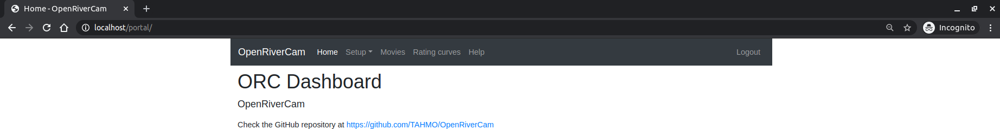
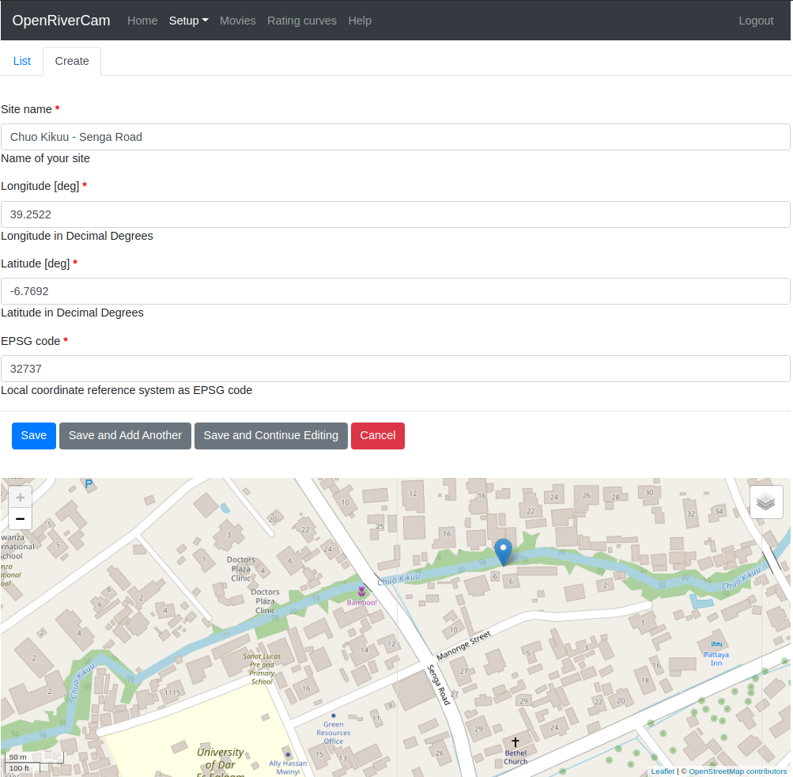
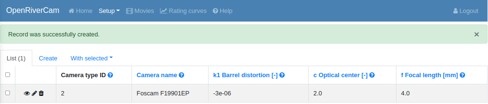
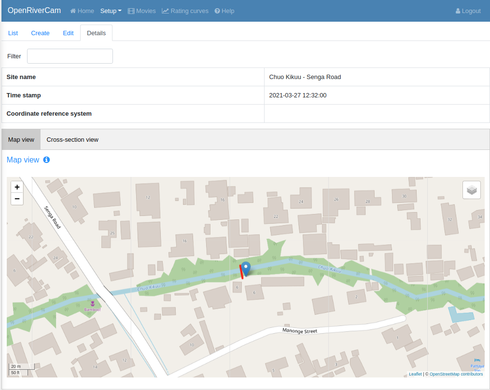
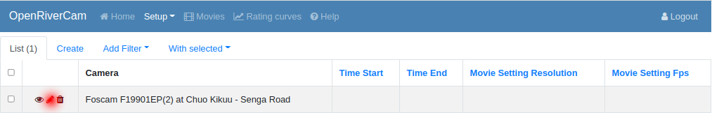
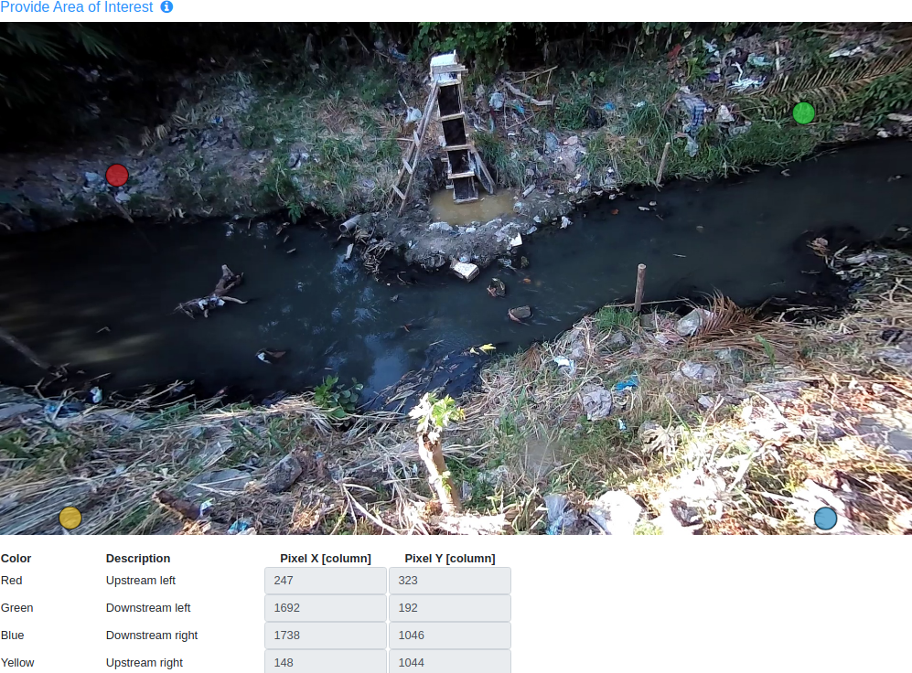
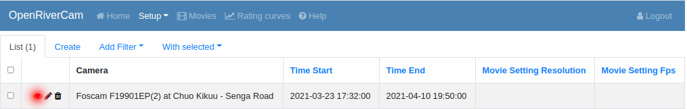
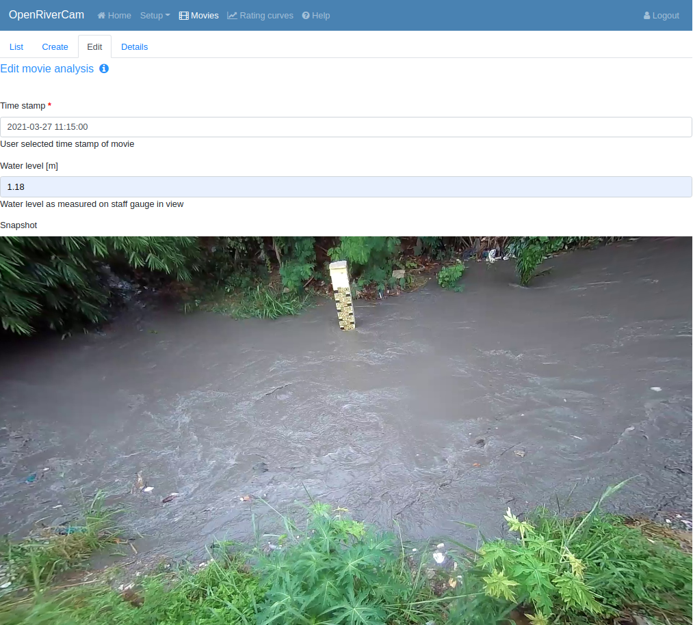

.. _tutorial:

Quick start
===========

To get you started with the software quickly, this section goes through all functionalities with an example package of data.
You can download this package in a zip-file from the following link: Click `here <https://github.com/TAHMO/OpenRiverCam/releases/download/v0.1/ORC_demo_videos.zip>`_  to download it.

The zip-file contains a set of sample videos to get you started. Please unzip all files to an easy to find location. It
should take you about one hour to complete this tutorial. It may take a bit longer if the system perfroming
the processing is not very fast. Note that the amount of work you have to do yourself is very limited!

We use Google Chrome throughout our tutorial.

First you have to go to the right website and login with credentials. There are two options here:

- Your administrator has deployed OpenRiverCam and has provided you with website and login details. Please use these
  by surfing on your favourite browser to the identified page and clicking on `Login` on the top-right of the site.
- You have started the service locally with the provided Docker image. In that case, please browse to `localhost` on
  your web browser. Click on `Login` and login with your credentials. If you haven't registered yet, then you will
  find a link to `register for an account` on this page. Click on it and choose an email address and a password of your
  choice. Then click on `Register`. You will now have a login for the next time you use OpenRiverCam, and you will
  automatically be logged in.

The result should be as shown below.

.. _tutorial_site_setup:

Setting up a new site
---------------------

For this tutorial we assume that a new camera has been installed on a new site, and that all required surveying has
been performed. For a manual on surveying, please refer to the :ref:`survey manual <survey>`. Therefore, we need to
establish a new site location and a new camera type and a new camera, of that camera type, belonging to the site
installation. Let's start with making a new site.

First select `Setup`, then `Sites`. You will see an empty list and empty world map, because you have not yet made any
sites yet. Now click on `Create`, and fill in the following details:

- Site name: Chuo Kikuu - Senga Road
- Longitude: 39.2522
- Latitude: -6.7692

The EPSG code will automatically be selected. Please keep the suggested number as is. Once the numbers are filled
out, you should see a marker on Dar es Salaam, on the Chuo Kikuu stream. You can zoom in and out to better inspect
the location. You can change the background map layers to see satellite or terrain views. You should see a view as
shown below. If you are satisfied, please click `Save` to go back to the list view. You will here see the site in the
world map as well.

For more information on creating a new site, please go to :ref:`Site management <sites>`.

Add a new camera type
---------------------
We are going to use a Foscam F19901 EP camera. We will add this camera type and its intrinsic lens characteristics to
our database. To do this, select `Setup`, `Camera types`, `Create`. Fill out the following details (check carefully
the value of the barrel distortion, it is negative and has 6 decimals, 5 zeros!):

- Camera name: Foscam F19901EP
- k1 barrel distortion [-]: -0.000003
- c Optical center [-]: 2
- f Focal length [mm]: 4

Click and `Save` and you should see a message that the record was successfully created, and the list view with your
new camera type, as below.

Add a bathymetry
~~~~~~~~~~~~~~~~
Now we will provide the bathymetry, that was measured during the survey on this site. Please go to `Setup`,
`Bathymetry`, and then choose `Create`. First you have to select for which site you wish to provide bathymetry, and
a time stamp. This is meant to ensure you can provide a new bathymetry in case the profile has been significantly
changing due to erosion and or sedimentation, or because you wish to use a profile that is over a part of the
objective that has more favourable conditions for particle image velocimetry, e.g. due to light conditions. You also
can provide an alternative Coordinate Reference System as EPSG code. If you do not provide this, OpenRiverCam
assumes you are providing coordinates in Longitude (x) Latitude (y), because most GPS hardware reports in Longitude
Latitude. OpenRiverCam automatically reprojects it to the site's local projection system. Leave this field empty!

Please select any time stamp you want for this demonstration. 
Once everything is selected, click on `Save` to store the new bathymetry. At this stage, it does not yet contain any
cross-section data.

Once you have select a site and time stamp, you can provide bathymetry cross-section data. We will choose a very fast
method to provide bathymetry, by giving a set of comma separated values in longitude, latitude, elevation format, and
the EPSG code above it. The EPSG code for regular latitude longitude is 4326. To do this copy and paste the CSV file
content shown below. If you provide a CSV text, please always use a flat text editor such as textpad, notepad++ or
your own favorite editor, not Word or Excel.

.. code-block::

    39.252163365,-6.76912008666667,-18.0319991607666
    39.2521632766667,-6.76912268833333,-17.9779991607666
    39.2521634916667,-6.76912599166667,-17.9489991607666
    39.2521630066667,-6.769130115,-17.8359991607666
    39.25216389,-6.76913343333333,-18.1069991607666
    39.252165055,-6.76913659666667,-18.0289991607666
    39.25216593,-6.769140815,-18.6139991607666
    39.2521661433333,-6.769144665,-19.2189991607666
    39.2521668333333,-6.76914837166667,-19.2069991607666
    39.252167195,-6.769153975,-19.2869991607666
    39.25216767,-6.76915663833333,-19.2779991607666
    39.252167945,-6.76915825333333,-19.2849991607666
    39.2521694266667,-6.76916068333333,-19.2729991607666
    39.2521713366667,-6.76916559333333,-19.2799991607666
    39.25217169,-6.769167805,-19.2429991607666
    39.2521741866667,-6.76917215,-19.2499991607666
    39.2521748333333,-6.76917394166667,-19.2489991607666
    39.2521762533333,-6.76917648166667,-19.2789991607666
    39.2521762533333,-6.76917648166667,-19.2789991607666
    39.252176735,-6.769178775,-19.2739991607666
    39.2521767583333,-6.76918126166667,-19.0549991607666
    39.2521767833333,-6.76918686666667,-18.6559991607666
    39.2521762166667,-6.76918829333333,-18.5659991607666
    39.252176145,-6.76919084,-18.2629991607666
    39.2521764333333,-6.76919256333333,-17.9069991607666
    39.25217638,-6.76919439166667,-17.8139991607666
    39.2521767816667,-6.76919715333333,-17.6219991607666
    39.2521772533333,-6.76920004166667,-17.3049991607666
    39.252177765,-6.76920142,-17.1069991607666
    39.2521777033333,-6.769204245,-17.1069991607666
    39.2521777766667,-6.769206575,-17.0409991607666

Copy-paste the entire contents into the text area where indicated, and click on `Store CSV`. Accept the warning
message, and you will be brought to the details page that shows the site location, with the spatial coordinates of
the profile points. You can also click on `Cross-section view` to see the bathymetry from left to
right bank as a profile. Below you can see this result.

Add a new camera
----------------
Now we want to add a camera, that is located at a specific site. Go to `Setup`, `Cameras on sites`, `Create`. Now
select the site, and select which camera type you have on this site. We currently only have one for both, so the
selection is quite easy. Also select the status. The camera is active, meaning that you should select
`CAMERA_STATUS_ACTIVE` as a state. Again click on `Save` to continue, and see the result.

Camera configuration
------------------------------
Now we go to a more extensive configuration part: the camera configuration. Here we have to provide the information
of the survey, and define the window size of the velocimetry methods we want to use. The camera configuration needs
to be done using a small video, in which ground control points and a staff gauge or something else that can be
used to read the water level, are visible. Typically such a short movie is taken during the field survey during low
flow conditions.

The camera configuration has several parts, that we will go through one by one.

Add a new camera configuration
~~~~~~~~~~~~~~~~~~~~~~~~~~~~~~
First, a new camera configuration has to be initialized, and tied to a given site and camera used on that site. Click
on `Setup`, `Camera configuration`, `Create`. Now you have to select for which camera, you wish to provide a
configuration. We are doing this for the camera we just created in the previous step. Select this camera
and click `Save` to continue. You now have an empty camera configuration, tied to a site location and camera type. This
needs to be edited in the following steps.

Camera config step 1:
~~~~~~~~~~~~~~~~~~~~~
To go to the first configuration step, click on the `Edit` button, left of the new camera configuration, as shown in
the image below.

A new screen will be shown where you can insert the following:

- Time Start: this is the start time of the period in which the camera configuration is valid. If you change the
  orientation of the camera or anything else, then you have to make a new camera configuration and ensure the old one
  becomes invalid and the new one receives a start time commensurate with the validity period. Select for instance
  today as a Time Start value. For this tutorial choose any date you like.
- Time End: Here select any day in the future. This is the end time of the period in which this configuration is
  valid. After this period, you may install for instance a new camera, or alter the angle or anything else about the
  camera configuration. For this tutorial choose any date you like.
- File: here we need to provide a sample movie in which the ground control points are visible, taken during the
  survey period. Here, select the video `control_point.mkv` from the tutorial Zipfile.

Once all fields are provided, click on `Save`. You should see a `Please wait` page. If you do not see this. Please
refresh the page by pressing Ctrl-R on your keyboard.

Camera config step 2:
~~~~~~~~~~~~~~~~~~~~~
After a short while, you are redirected to a new page where you can provide the survey information.
At the top, you can again select the Coordinate Reference System used during the survey. If you do not provide any
value, Longitude (x) Latitude (y) is assumed, as most GPS systems report in this coordinate system. Provide a valid EPSG
code if you have measured in another projection system. Then move to the configuration of ground control points.

Please do the following:

- click on all four ground control points in the order defined in the table below. So start with the top-left
  coordinate to make sure you don't mix coordinates up. Remember we leave the Coordinate Reference System blanc,
  therefore, the coordinates below are in latitude longitude. They have to be selected with many decimals. 7 decimals
  means roughly an precision in the centimeter range.
- fill out the right coordinates with the right ground control point, looking at the color coding. You will see
  it follows the same order. You can click points in different orders. Just make sure that the coordinate you enter
  matches the right color as indicated below.

The coordinates are provided in the table below. The process is highlighted in the animation below the table. Note
that in this animation, the values are entered very fast because they were available in the browser's cache. You will
have to type them in very carefully or copy paste them from the table. Make sure that the `-` (minus) signs in each
Y-coordinate are typed in correctly.

=============  =======================  =======================
Control point  Coordinate X [lon or m]  Coordinate Y [lat or m]
=============  =======================  =======================
top-left       39.2521259               -6.7691474
top-right      39.2522168               -6.7691393
bottom-right   39.2522104               -6.7691645
bottom-left    39.2521400               -6.7691770
=============  =======================  =======================

.. image:: img/gcps.gif

Fill out the following water levels:

Height of water level in coordinate system [m]: -17.50
Staff gauge water level during taking of the gcp points [m]: 0.1

.. note:: the first water level value is the level during the survey, within the used coordinate reference system.
   The second value is the value that is read from the staff gauge in view. Within this example the staff gauge was
   not yet finalized. It has been read from a later snapshot.

Below that, click on four points in the right order, to identify the area of interest. The order is important because
it will ensure that in the orthoprojected frames, water always flows from left to right on your screen. Spurious
velocities will also be filtered, if they point in the wrong direction.

First click on the top-left part which is the upstream left-bank, then the top-right (downstream left-bank), then
bottom-right, and finally bottom-left. You should have something as shown below with the colors in the right order. If
you want to remove a wrongly selected point, then right-click on it.

Then fill out the location of the camera in the used coordinate reference system as follows:

=============================  =======================
Lens coordinate X [lon or m]:  39.2522015333333
Lens coordinate Y [lat or m]:  -6.76920395
Lens coordinate Z [m]:         -14.38
=============================  =======================

Pixel size can be set at 0.01 m.

Click on `Next`.

Camera config step 3
~~~~~~~~~~~~~~~~~~~~
In the third step, you will see one reprojected frame in your browser. Here you can see that the reprojection has
been done taking the water surface as the vertical reference. All areas outside the water surface are in reality
higher than the water surface, and therefore these areas also look extruded in the image. Because we are interested
in the water surface only, this is not a problem. In this view, you can decide on a so-called window size. This is
the window over which one expects to see clear patterns such as debris floating by, bubbles, eddies, and so on. If
you choose this too small, then most likely the software will not be able to find real patterns to trace movements of
water with. If you choose this too high, then too large scale patterns are observed to trace local velocities. A
typical scale used is in the order of 20 to 50 centimeters (i.e. 0.2 to 0.5 meters). The window size must be provided
in pixels. Therefore here, you will need to consider the chosen resolution (in this example set to 0.01 m, i.e. 1 cm)
to select the right value. Here choose 30 pixels. You will see a small red box that indicates the size of this area
on the projected image. Click on `Save` to finalize the configuration.

.. note::
   We will change the last step so that you can also provide a window size in meters distance, instead of pixels.

After clicking `Save`, you can go back to the `List` view by clicking on `List`. You should now see the configuration
with start and end time appearing in the list. You can also click on details (see red dot below) to see all the
information about the camera configuration as it appears in the database ofd OpenRiverCam. This is rather technical,
so not treated any further here.

.. _tutorial_movie_process:

Process a new movie
-------------------
Now that a camera configuration is in place, we can start processing movies. This step is relatively easy, and
intended to be done on a operational basis, once a camera is installed and entirely configured.

Upload a new movie
~~~~~~~~~~~~~~~~~~
First click on the menu item `Movies`. You will see a list of all movies so far supplied to
OpenRiverCam under your own user account. If this is the first time you work with OpenRiverCam, this list will be empty.

To upload a new movie, click on `Create`. Now you can define the following:

- the camera configuration your new movie belongs to (remember that you may have many sites with cameras, and
  therefore many different camera configurations). As we have so far only defined one, you will only see the camera
  configuration we have just prepared.
- the time stamp of the movie. You may use the time of creation of the movie for instance, or read the time from the
  movie frames, when you play them in your favourite video player. Our movie was recorded 27 March 2021 at 11.15 in
  the morning. Please select this time.
- the movie file. Here click on `Choose file` and select the sample video, that is supplied in the sample data set
  with the name `clip_schedule_20210327_111555.mkv`.

Click on save to upload the movie. You should now see the list of movies, belonging to your account, but now with the
movie added that you just uploaded. The name of the site, the file name, time stamp, and a movie status indicator are
provided. The status indicator should say `MOVIE_STATUS_NEW` to indicate that the movie is only uploaded and not yet
processed.

Processing a movie
~~~~~~~~~~~~~~~~~~
To process a new movie, only one additional piece of information is needed: the water level. To supply this click on
the `Edit` button (indicated with a pencil icon) left of your just uploaded movie. Read the water level from the
staff gauge. You will find that it is about 1.18 meters. Fill out this value in the `Water level [m]` field and click
on `Save`. You are now redirected back to the list of movies, but now you will see that the water level is in
the table, and that the status of the movie changed to `MOVIE_STATUS_PROCESSING`. This means that the back-end of
OpenRiverCam is crunching the numbers. It may take a while before the results appear. You can reload the page a few
times to see if the status already has changed.

.. note:: If you click on the `Edit` button really fast after the upload procedure, you may find a message indicating
   that the frame is not yet available. Please reload a few times to see the frame appearing and then continue the
   process as normal.

.. note:: The processing may take several minutes. In a future release, we will add a progress bar to provide a user
   with feedback on the processing status.

Inspecting results
~~~~~~~~~~~~~~~~~~
If the status becomes `MOVIE_STATUS_FINISHED`, the table will display the median discharge in m3/s as well as a
number of percentiles that can be used to better understand the uncertainties. Uncertainties are currently estimated
very conservatively, as the tool assumes that errors are fully correlated in space. We are still working on more
reliable error estimates. Nonetheless these estimates are very useful to get a feeling of the relative uncertainties
between different movie analyses.

You can now click on the `View` button left of the movie in the table, indicated with an eye icon. This will show the
results of the analysis, including the median velocity estimates on the water surface. Yoiu will see that not the
entire water surface contains velocity estimates. This is because OpenRiverCam contains sophisticated filters, that
automatically detect spurious velocities or velocities at places where too little patterns were available to provide
reliable estimates. The filters use spatial and temporal logics to perform this filtering. For instance, when
velocities in a certain window move from left to right all the time, it is likely that overhanging vegetation was
present in this window, that moved from left to right due to wind.

Velocities in the cross section that are unknown but needed for a full cross-sectional river flow estimate are
estimated by fitting a logarithmic relationship between velocity and depth in the places with known velocities. This
ensures that your discharge estimate always integrates over the entire width of the stream, and no cross-sectional
area is missing. For more details on this approach we refer to :ref:`movie_processing`.

.. image:: img/tutorial_movie_details.gif

.. note:: Currently, it is assumed that the first 5 seconds of a movie contain enough information to estimate river
  flow. Longer videos will only be processed for the first 5 seconds. Dependent on feedback from users, we may make
  this a configurable option.

.. _tutorial_rating:

Establish a rating curve
------------------------

Get more results than one movie
~~~~~~~~~~~~~~~~~~~~~~~~~~~~~~~
In order to prepare a rating curve, more videos need to be supplied. OpenRiverCam demands a minimum of 5 rating
points before the results will appear. In the tutorial data, we have also supplied a number of additional movies for
you to process in exactly the same way. To make it really easy, we recommend that you do this in the following manner:

- First upload all the movies, by clicking `Create` and follow the same steps as in the first movie.
- Once all movies are in the list with status `MOVIE_STATUS_EXTRACTED`, go through each one of them by clicking on the
  `Edit` button and reading and filling out the water level from the staff gauge. If you want to enlarge the
  snapshot, please right-click on the image and select `Open image in new tab`. You can then even zoom in to the image.
  Once you have read it, close the tab and enter the value in the window.

If you do it in this order, all movies are placed in a queue for processing. You simply can go grab a coffee or tea,
and occasionally check if new movies have reached the `MOVIE_STATUS_FINISHED` status. Note that per movie, dependent
on the speed of the system doing the processing, it may take 5 to 10 minutes per movie.

Create a new rating curve from videos
~~~~~~~~~~~~~~~~~~~~~~~~~~~~~~~~~~~~~
Once all movies have reached the `MOVIE_STATUS_FINISHED` status, you can select all the movies you have processed,
using the tick boxes left of the movie. To select all movies in the shown list, simply tick the tick box in the upper
left corner of the table.

Now, you are ready to put the results of the selected movies in a rating curve (i.e. a relationship between water
levels and river flows). To make it really simple to achieve this, click on `With selected` and then select `Make
rating curve`. If you wish to further manipulate or investigate this rating curve view, please refer to :ref:`rating`.

You now have generated your first rating curve with OpenRiverCam, using camera footage of one single event, combined
with a relatively simple field survey. A few things to note at the end of this tutorial:

- if the bathymetry changes severely, you can of course do a new field survey to update the bathymetry. Any new video
  uploaded will always use the latest bathymetry record provided to estimate the cross sectional flow.
- in a similar way, if you decide to change your camera on site, for instance by replacing it for a new model, or
  by repositioning it or changing its field of view, you need to provide a new camera configuration for that. Simply
  re-establish a few temporary ground control points such as the wooden poles shown in our sample video, or anything
  else that you can easily fix on the water surface, after you have changed the camera's situation. Do a field survey
  of their position on the water surface. Take a short movie of the situation with the camera in its final position
  and then make a new camera configuration based on your measurements. Make sure that you also always measure the
  position of the lens of the camera.
- If you like this software, and have requests for new features, please reach out to us via info@rainbowsensing.com or
  info@tahmo.org. You can also visit the software's code page on github and submit new feature requests
  there, on https://github.com/TAHMO/OpenRiverCam.
